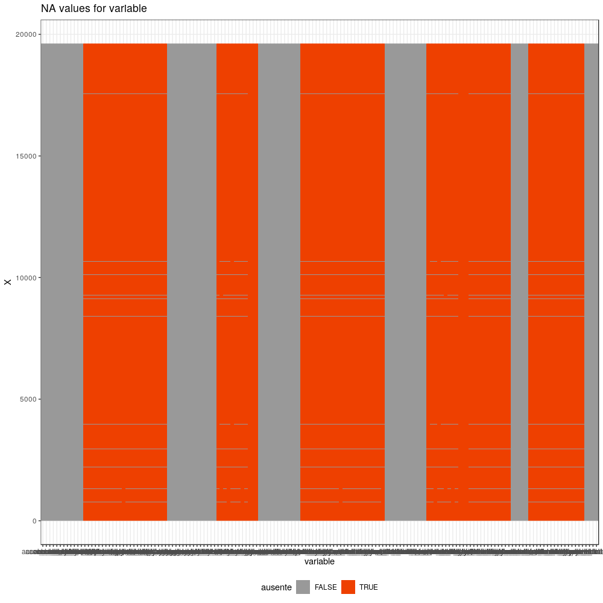
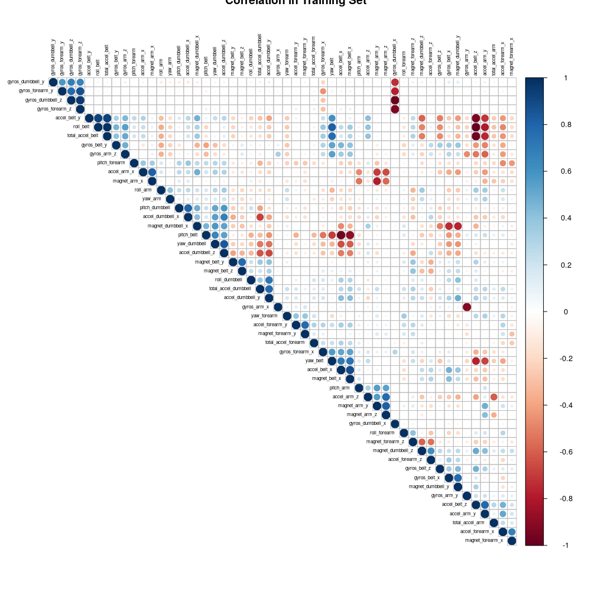
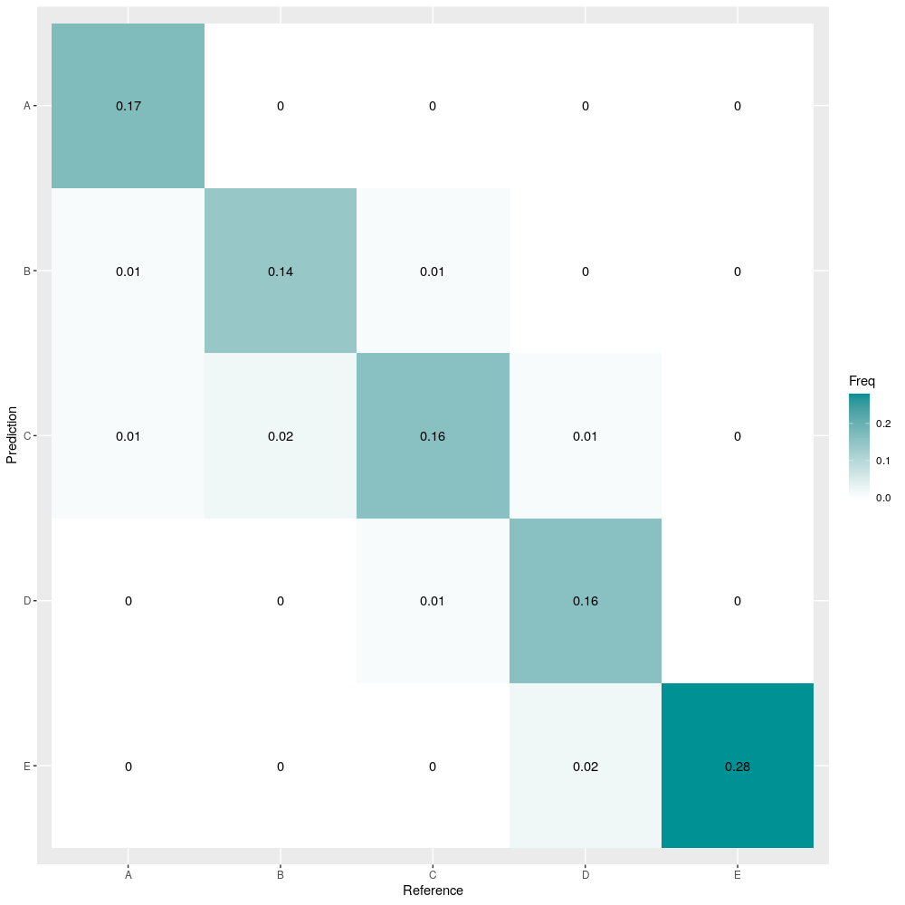
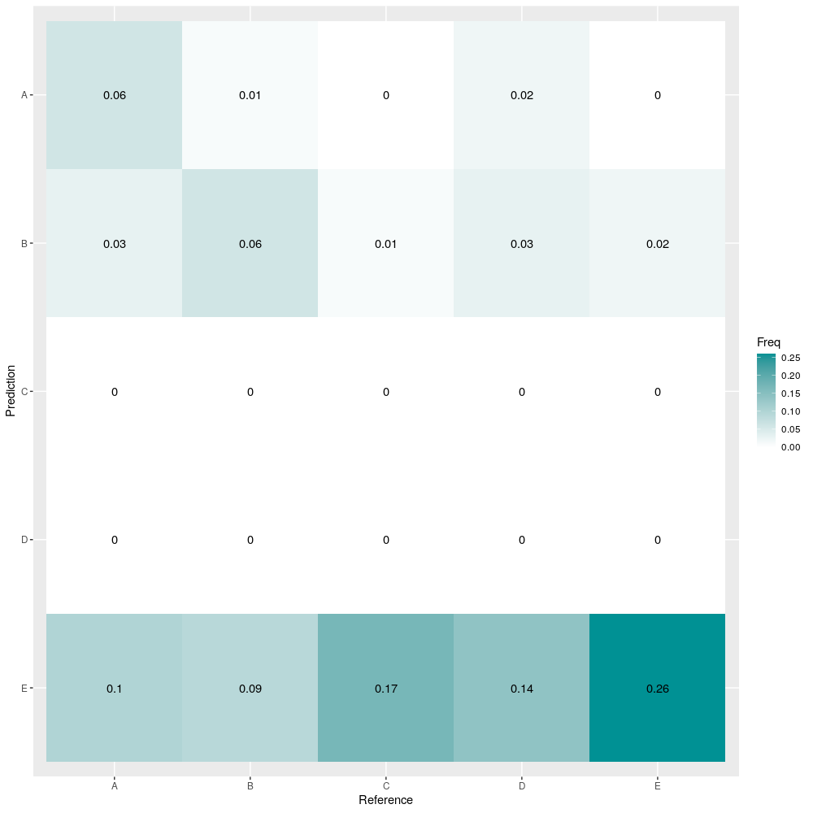
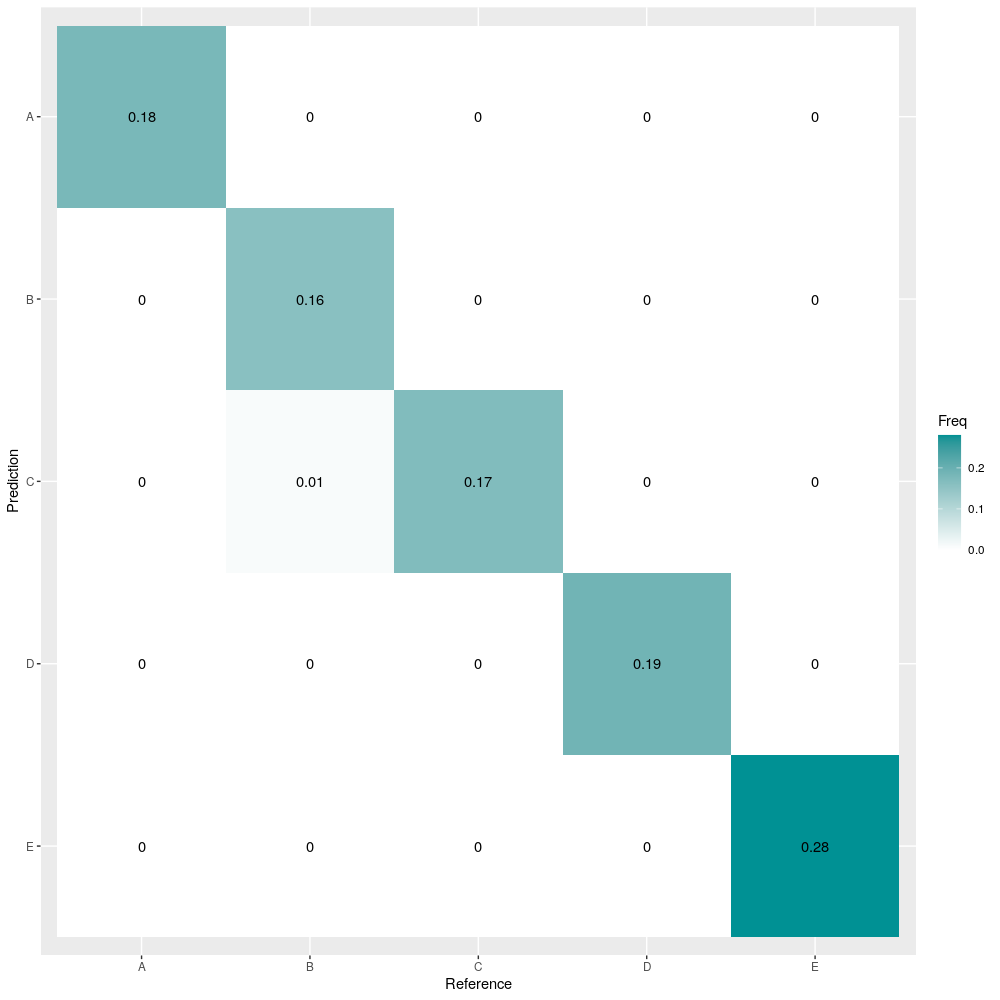

Nowadays people try to do exercise whenever they can, but they actually do not know if they do exercise correctly and avoid any injuries. So, this project's goal determining when people do an exercise correctly or not based on some collected measures from wearables.

## Downloading Training and Test Data
The data for this project comes from [http://web.archive.org/web/20161224072740/http:/groupware.les.inf.puc-rio.br/har](http://web.archive.org/web/20161224072740/http:/groupware.les.inf.puc-rio.br/har)
```{r, message=FALSE, echo=FALSE}
url_training <- "https://d396qusza40orc.cloudfront.net/predmachlearn/pml-training.csv"
url_test <- "https://d396qusza40orc.cloudfront.net/predmachlearn/pml-testing.csv"

if (!dir.exists("data")) {
  dir.create("data")
  download.file(url = url_training, destfile = "data/train.csv")
  download.file(url = url_test, destfile = "data/test.csv")
}

```
## Loading Data and libraries
Before loading the data, it is neccesary to look inside the files how it is structured. So, I noticed it has many empty strings (""), so we need to define na values in the *read.csv* function.
```{r, echo=FALSE, message=FALSE}
install.packages("corrplot", dependencies = T)
install.packages("tidyverse", dependencies = T)
install.packages("rattle", dependencies = T)
install.packages("rpart", dependencies = T)
install.packages("klaR", dependencies = T)
library(caret)
library(ggplot2)
library(tidyverse)
library(corrplot)
library(dplyr)
library(rattle)
library(randomForest)
library(klaR)


training <- read.csv("data/train.csv", na.strings=c("NA","#DIV/0!",""))
testing <- read.csv("data/test.csv", na.strings=c("NA","#DIV/0!",""))

```

## Cleaning Data
One interesting thing is look at how NA values we have. In order to check how NA values are distributed is with the image. The color red represents when we have a NA values in our data, in other case is not a NA value.    
```{r}
datos_long <- training %>% gather(key = "variable", value = "valor", -X)
datos_long <- datos_long %>%  mutate(ausente = is.na(valor))

png(file="na_values.png", res=96, width=1000, height=1000)
ggplot(data = datos_long, aes(x = variable, y = X, fill = ausente)) +
  geom_raster() +
  scale_fill_manual(values = c("gray60", "orangered2")) +
  theme_bw() +
  labs(title = "Valores ausentes por variable") +
  theme(legend.position = "bottom")
dev.off()
```

It is totally clear that there are a lot of NA values in our dataset. So we need to exclude them in our analysis. Additionally, we can use the funcion *map_dbl* to see how many NA values for each variable we have in our data after cleaning.
```{r}
index_notNA <- colSums(is.na(training)) == 0 & colSums(is.na(testing)) == 0
training <- training[,index_notNA]
testing <- testing[,index_notNA]

#sort(colnames(train)) == sort(colnames(test))
#setdiff(colnames(train), colnames(test))
#setdiff(colnames(test), colnames(train))

map_dbl(training, .f = function(x){sum(is.na(x))})
```
Additionally, I noticed the first seven varaibles do not offer any important information because there are string or incremental variables.  
```{r}
str(training)
```
So, we ommit them.  
```{r}
training <- training[,-c(1:7)]
testing <- testing[,-c(1:7)]
```

## Partition
```{r}
set.seed(123)
indexTrain <- createDataPartition(y=training$classe, p=0.7, list=FALSE)
training_tr <- training[indexTrain, ]
valid <- training[-indexTrain, ]
```

Another fact, it find which varaibles are highly correlated. If we can find them, we can ommit some of them in order to get loss computational load but still have a good accuracy.  For that purpose, we use *corrplot* with order set to hclust to see some possible omissions in our analysis.  

```{r}
png(file="correlation_train.png", res=96, width=1000, height=1000)
corrplot(cor(training_tr[, -53]), order = "hclust", tl.cex = 0.5, type = "upper", tl.col = "black", title = "Correlation in Training Set")
dev.off()
```

In order to figure out how many variables are highly related each other, we could filter with *which* function.  
```{r}
M <- abs(cor(training_tr[,-53])); 
diag(M) <- 0
paste("There are ", dim(which(M > 0.72, arr.ind = T))[1] / 2, "variables highly correlated each other.")
```

Later, in order to scale with our methdology, I surround with PCA.  
```{r}
set.seed(123)
pp_pca <- preProcess(training_tr[,-53],method="pca", thresh=0.95)
```

In this case, we need to reformat out valid and training_tr data set.
```{r}
classes <- unique(training_tr$classe)
training_pca <- predict(pp_pca, training_tr[,-53]) 
training_pca$classe <- training_tr$classe

valid_pca <- predict(pp_pca, valid[,-53]) 
valid_pca$classe <- valid$classe

```

### Support Vector Machine
```{r}
set.seed(123)

control_train <- trainControl(method = "repeatedcv", number = 3,
                              repeats = 2, returnResamp = "final", verboseIter = FALSE,
                              allowParallel = TRUE)

hiperparametros <- expand.grid(sigma = c(0.001, 0.01, 0.1, 0.5, 1),
                               C = c(1 , 20, 50, 100, 200, 500, 700))

modelo_svm <- train(classe ~ ., data = training_pca,
                   method = "svmRadial",
                   tunidGrid = hiperparametros,
                   metric = "Accuracy",
                   trControl = control_train)


predicted_svm <- predict(modelo_svm, valid_pca)
confusion_matrix_svm <- confusionMatrix(valid$classe,predicted_svm)

plt <- as.data.frame(round(prop.table(confusion_matrix_svm$table), 2))


plt$Prediction <- factor(plt$Prediction, levels=rev(levels(plt$Prediction)))

png(file="cm_svm.png", res=96, width=1000, height=1000)
ggplot(plt, aes(Prediction,Reference, fill= Freq)) +
        geom_tile() + geom_text(aes(label=Freq)) +
        scale_fill_gradient(low="white", high="#009194") +
        labs(x = "Reference",y = "Prediction") +
        scale_x_discrete(labels= classes) +
        scale_y_discrete(labels=rev(classes))
dev.off()
```


### Decision Tree
```{r}
control_train <- trainControl(method = "repeatedcv", number = 3,
                              repeats = 2, returnResamp = "final", verboseIter = FALSE,
                              allowParallel = TRUE)
modelo_dt <- train(classe~., data=training_pca, method="rpart", trControl=control_train)

predicted_dt <- predict(modelo_dt,newdata=valid_pca)
confusion_matrix_dt <- confusionMatrix(valid_pca$classe,predicted_dt)

plt_dt <- as.data.frame(round(prop.table(confusion_matrix_dt$table), 2))
plt_dt$Prediction <- factor(plt_dt$Prediction, levels=rev(levels(plt_dt$Prediction)))

png(file="cm_dt.png", res=96, width=1000, height=1000)
ggplot(plt_dt, aes(Prediction,Reference, fill= Freq)) +
        geom_tile() + geom_text(aes(label=Freq)) +
        scale_fill_gradient(low="white", high="#009194") +
        labs(x = "Reference",y = "Prediction") +
        scale_x_discrete(labels= classes) +
        scale_y_discrete(labels=rev(classes))
dev.off()

```



### Random Forest
```{r}
control_train <- trainControl(method = "repeatedcv", number = 3,
                              repeats = 2, returnResamp = "final", verboseIter = FALSE,
                              allowParallel = TRUE)
model_rf <- train(classe~., data=training_pca, method="rf", trControl=control_train, verbose=FALSE)

predicted_rf <- predict(model_rf,newdata=valid_pca)
confusion_matrix_rf <- confusionMatrix(valid_pca$classe,predicted_rf)

plt_rf <- as.data.frame(round(prop.table(confusion_matrix_rf$table), 2))
plt_rf$Prediction <- factor(plt_rf$Prediction, levels=rev(levels(plt_rf$Prediction)))

png(file="cm_rf.png", res=96, width=1000, height=1000)
ggplot(plt_rf, aes(Prediction,Reference, fill= Freq)) +
        geom_tile() + geom_text(aes(label=Freq)) +
        scale_fill_gradient(low="white", high="#009194") +
        labs(x = "Reference",y = "Prediction") +
        scale_x_discrete(labels= classes) +
        scale_y_discrete(labels=rev(classes))
dev.off()

```


